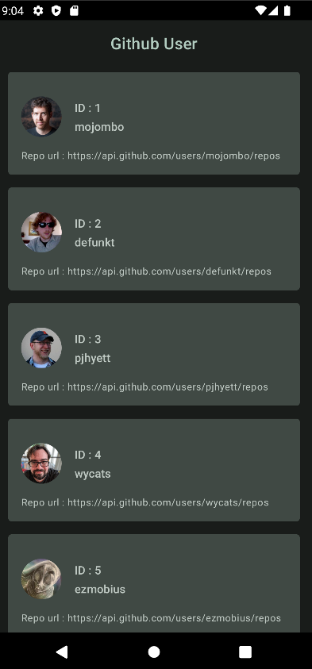
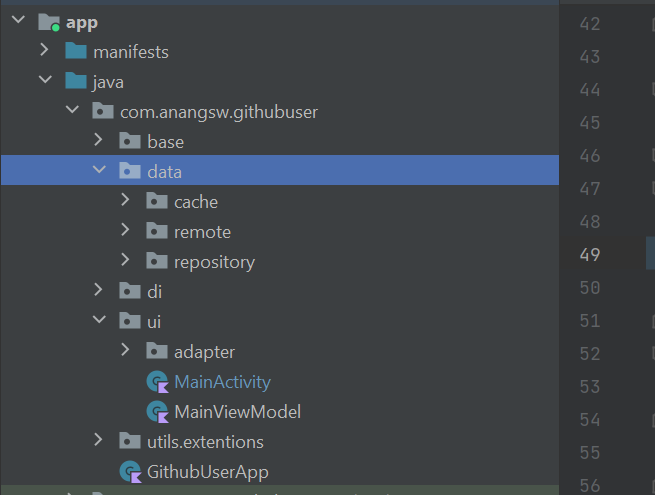

# Repository ini berisi aplikasi untuk menampilkan user github
## Screenshoot

## Project architecture

- base : berisi base activity yang bisa di gunakan di semua activity
- ui : berisi tampilan utama dalam aplikasi
- data : berisi datasource baik lokal maupun remote
- di : berisi kelas untuk dependency injection
- utils : berisi utility lain yg di gunakan di aplikasi